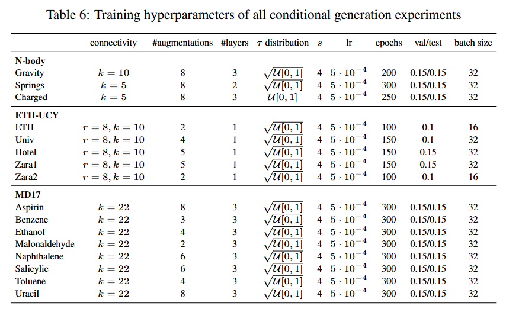

# STFlow: Flow Matching for Geometric Trajectory Simulation

This repository is the official implementation of the paper called [Flow Matching for Geometric Trajectory Simulation](https://arxiv.org/abs/2505.18647)

[](https://arxiv.org/abs/2505.18647) 
[](https://creativecommons.org/licenses/by-nc/4.0/)


## Requirements

We have used Python 3.12.2 (https://www.python.org/downloads/release/python-3122/) and have not checked other verisons.

To install all requirements, given Python is correctly installed, run in the root directory of the codebase:

```setup
pip install -r requirements.txt
```

## Datasets and Pretrained model

In order to train or evaluate the model, you will need the datasets to be stored in the `data` folder. 

Download link for data folder including NBody and ETH-UCY and the `final_weights` folder containing all pretrained models (1.8GB):  https://drive.google.com/file/d/1z4tLsR59rKpCa72J4BXa9dqWRg4NgX_p

Link for MD17 (Numpy buttons under the yellow box) https://www.sgdml.org/#datasets

After downloading, put the MD17 .npz files in the `data/raw/md17`folder

Make sure that the `data` and `final_weights` folder are in the same directory as this README file.
The `data` folder should contain the subdirectories `raw` and `processed` and inside `raw` the subdirectories `nbody`, `pedestrians/ETH` and `md17`, which are included in the first download link.


## Config
All the configuration settings are in the `configs.py` file.
This file is used for preprocessing, hyperparameters or other settings.
Before running, make sure that the parameters align with the values specified in the Appendix and in the image below, marked by comments in the file.

The `config.py` file as downloaded contains the correct training and inference settings for Gravity (NBody), ETH (ETH-UCY) and Ethanol (MD17).  



The `type` parameter specifies the sub-dataset to use. For NBody, it can be `charged`, `gravity` or `springs`. For ETH, it can be `0`, `1`, `2`, `3` or `4`, which correspond to `ETH`, `Hotel`, `Zara 01`, `Zara 02` and `Univ` respectively, note this ordering is not equal to the paper. For MD17, they correspond to the names of the molecules: `aspirin`, `benzene`, `ethanol`, `toluene`, `uracil`, `malonaldehyde`, `naphthalene`,`salicylic`.

When using the `charged` nbody dataset, the node_features key `charge` should be uncommented.
When using the `springs` nbody dataset, the node_features key `spring` should be uncommented.

Then, the `weights_path` parameter should be set, specifying the path to the weights of the model to use for the specified dataset, located in the `final_weights` folder.


## Logging with Weights and Biases
The code uses Weights and Biases for logging and visualization. When running it for the first time, you will need to login to the platform by running:
```
python
import wandb
wandb.login()
```
If you do not want to use W&B, set the DEBUGGING flag to True in the `main.py` file.

## Training

When the data is in place and the config file is updated:

1. Specify in the `main.py` file which dataset and corresponding config to use (NBody, ETH, MD17) by uncommenting the corresponding line and commenting the other lines at the top of the file.

2. Check if the TRAIN flag is set to True in `main.py`, at the top of the file.

3. Run:

```
python main.py
```
This will train STFlow on the specified dataset, evaluate it on the test set and log the results to the terminal and W&B if the DEBUGGING flag is set to False. 

## Evaluation

To only evaluate the model:
1. Check if datasets are in the `data` folder, as described above.

2. Check if the weights are in the `final_weights` folder, as described above.

3. Check if the `type` and `weights_path` parameter in the config file is set correspondig to the dataset and weights to use, as described above.

4. Set the `DEBUGGING` flag to True if you do not want to use Weight&Biases logging.

5. Set the `TRAIN` flag to False in `main.py`, at the top of the file.

6. Run:

```
python main.py
```

The results are printed to the terminal (and logged to W&B).


## Results

Our model achieves the following performance, measured by Average and Final Displacement Errors:


Please note that evaluating the model using these steps with the pretrained weights might give slightly better or worse results than presented in the paper, as most, but not all hyperparameters of the pretrained models match exactly as the ones used in the paper. The hyperparameters as stated in the Appendix have been used to generate the results in the paper.

Please also note that the model is probabilistic, such that results can vary slightly from run to run, especially on the ETH-UCY datasets which have fewer samples.

